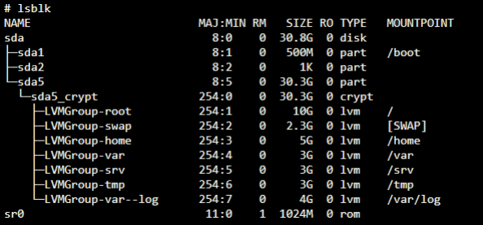
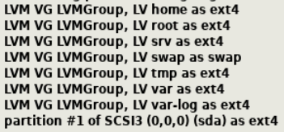
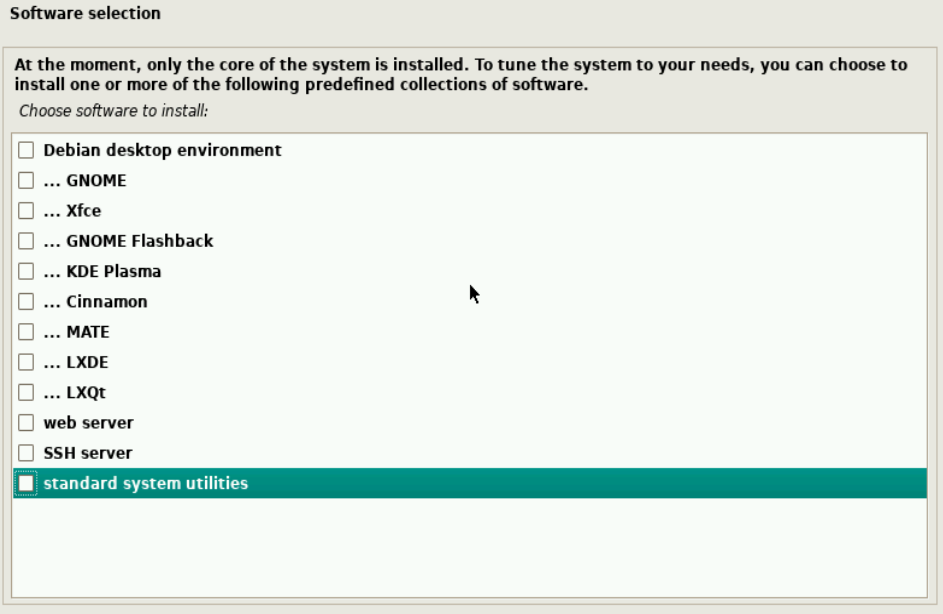
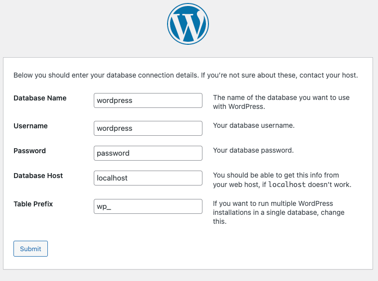
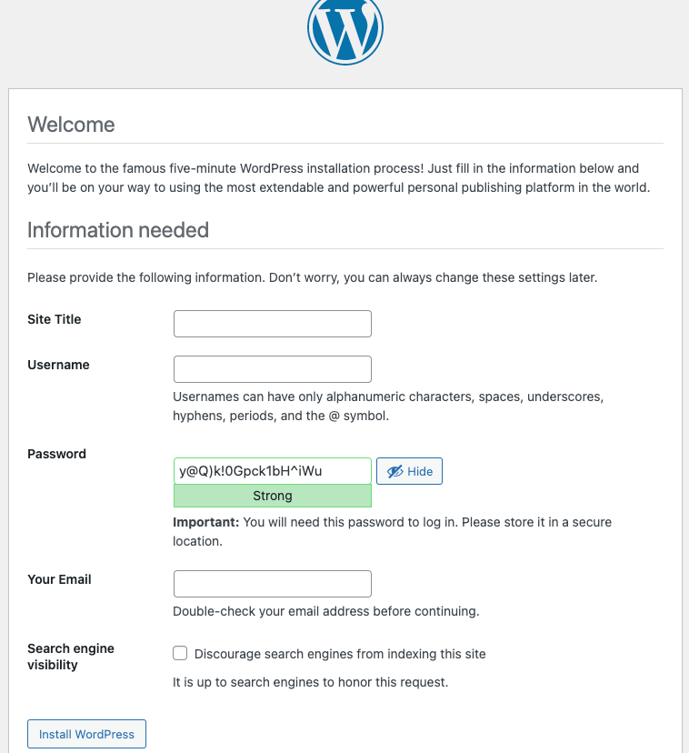
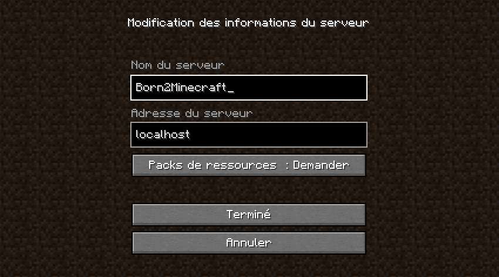
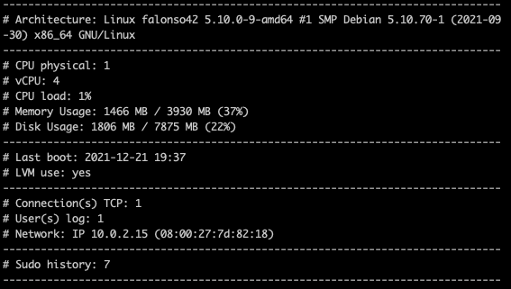
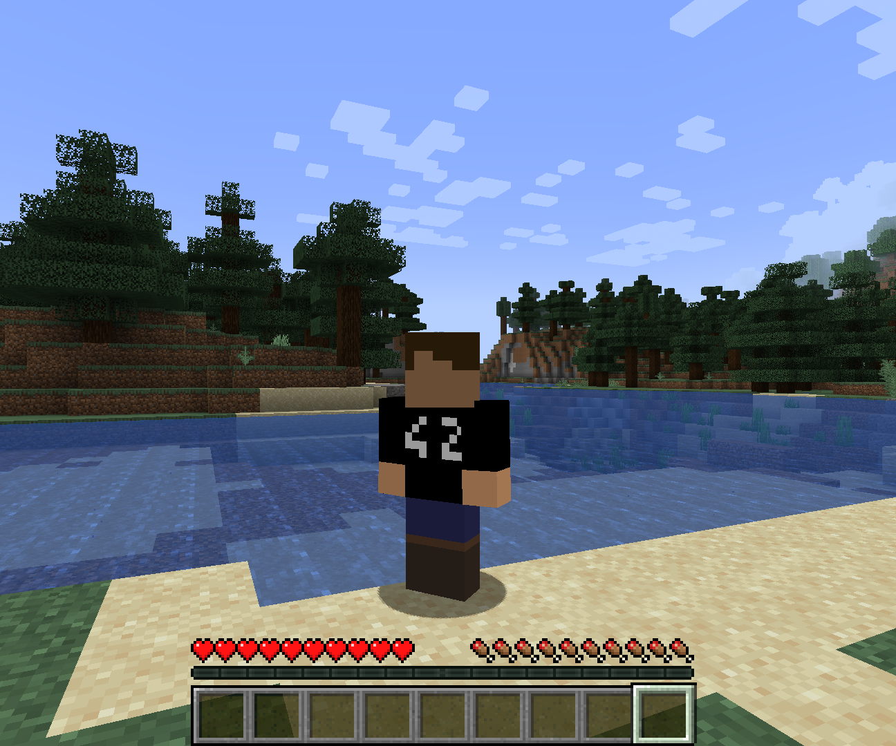

<h1 align="center">Born2BeRoot</h1>

Quatrième projet de [42](https://42.fr/), le but est de créer une machine virtuelle avec des partitions chiffrées, une politique de mot de passe forte ainsi que de créer un script de monitorage.

Les bonus consistent à auto héberger un site web avec le CMS WordPress et ajouter un service supplémentaire, dans cet exemple, un serveur Minecraft.

---

## Tâches à réaliser : 

#### Mise en place de la machine virtuel.
- [x] Installer VirtualBox.
- [x] Créer une machine virtuelle avec 8Gio de stockage, 4Gio de RAM, carte réseau en mode NAT.

#### Installation de Debian.
- [x] Téléchargement de l'ISO Debian [stable net install](https://cdimage.debian.org/debian-cd/current/amd64/iso-cd/debian-11.1.0-amd64-netinst.iso) et lancer l'installation.

- [x] Partitionner les disques pour avoir une structure proche de celle-ci : 
    
  
   - 1. Durant l'installation :
     

  

- [x] Installer **aucun** des paquets proposés par [tasksel](https://wiki.debian.org/fr/tasksel).
    


#### Configuration et installation de divers services.

- [x] Mettre à jour la liste des paquets disponibles.
   - 1. Passer en sudo : `su`.
   
   - 2. Mettre à jour les paquets : `apt-get update`.
   
       
  
- [x] Installer `sudo` et y ajouter un utilisateur.
   - 1. Installation : `apt-get install sudo ` .
   
   - 2. Ajout d'un utilisateur à sudo : `sudo usermod -a -G sudo intra_login`.
   
   - 3. Éditer le fichier sudoers et y ajouter un utilisateur grace à `sudo visudo` et y ajouter :
   
          ```bash
          intra_login    ALL=(ALL) ALL
          ```

   - 4. Redémarrer la machine virtuelle `sudo reboot`.
  
- [x] Copier l'historique des commandes exécutées avec le programme `sudo` dans un fichier distinct.
   - 1. Éditer le fichier de configuration de `sudo` grace à `nano /etc/sudoers` et y ajouter :

          ```bash
          Defaults	logfile="/var/log/sudo/sudo.log"
          Defaults	log_input,log_output
          ```

   - 2. Créer le répertoire `/var/log/sudo` : `mkdir /var/log/sudo` .

   - 3. Redémarrer la machine virtuelle `sudo reboot`.

- [x] Installer un serveur `OpenSSH` et le faire écouter sur le port 4242, désactiver la connexion en root.
   - 1. Installation : `sudo apt-get install openssh-server` .
   
   - 2. Édition du fichier de configuration `sudo nano /etc/ssh/sshd_config`.
   
   - 3. Éditer `#Port 22` par `Port 4242`.
   
   - 4. Ajouter `PermitRootLogin no`.
   
       
  
- [x] Installer le part-feu `UFW` et n'autoriser que les connexions entrantes en 4242 (bannir toutes les autres) et vérifier qu'il soit actif au démmarage.
   - 1. Installation : `sudo apt install ufw`.
   
   - 2. Activation : `sudo ufw enable`.
   
   - 3. Autorisation des connexions sur le port 4242 : `sudo ufw allow 4242`.
   
   - 4. Afficher les règles de part-feu : `sudo ufw status`.
   
       
  
- [x] Modifier le hostname de la machine par `intra_login42`.
   - 1. Modification du hostname `hostnamectl set-hostname intra_login42`.
   
   - 2. Modification du nom de domaine local `sudo nano /etc/hosts` et éditer :
    ```
    127.0.0.1       localhost
    127.0.0.1       intra_login42
    ```
   
   - 3. Redémarrer la machine virtuelle `sudo reboot`.
   
       
  
- [x] Créer un utilisateur qui aura pour login `intra_login` et appartiendra au groupe `user42` et `sudo`.
   - 1. Création du groupe : `sudo groupadd user42`.
   
   - 2. Assignation d'un utilisateur à ce groupe : `sudo usermod -aG user42 intra_login42`.
   
       

#### Mise en place d'une politique de sécurité de mot de passe.
- [x] : Installation de `libpam-cracklib` afin de définir une politique de mot de passe : `sudo apt-get install libpam-cracklib` .

- [x] : Définir la politique de mot de passe en éditant le fichier `/etc/pam.d/common-password` : `sudo nano /etc/pam.d/common-password` afin d'imposer 10 caractères dont une majuscule et un chiffre, sans comporter 3 caractères consécutifs identiques en modifier la ligne `password	[success=1 default=ignore]` par :

  ```
   password	requisite			pam_cracklib.so retry=3 minlen=10 lcredit =-1 ucredit=-1 dcredit=-1 maxrepeat=3 usercheck=0 difok=7 enforce_for_root reject_username
   password	[success=1 default=ignore]	pam_unix.so obscure sha512
  ```


- [x] : Définir une politique d'expiration des mots de passe, expiration tous les 30 jours, modification possible tous les 2 jours, alerte de redéfinition de mot de passe 7 jours avant l'expiration en modifiant le fichier `sudo nano /etc/login.defs` : 

  ```
  PASS_MAX_DAYS 30
  PASS_MIN_DAYS 2
  PASS_WARN_AGE 7
  ```

- [x] : Appliquer la politique d'expiration de mot de passe aux utilisateurs déjà créés ainsi qu'à root.
   ```
   sudo chage -M 30 intra_login42
   sudo chage -m 2 intra_login42
   sudo chage -W 7 intra_login42

   sudo chage -M 30 root
   sudo chage -m 2 root
   sudo chage -W 7 root
   ```

- [x] : Définir un message d'erreur en cas d'echec à l'authentification en tant que `sudo`.
   - 1. Éditer le fichier de configuration `sudoers` : `sudo nano /etc/sudoers` et y ajouter :
    ```
    Defaults     badpass_message="So Long, and Thanks for All the Fish"
    ```

   - 2. Redémarrer la machine virtuelle `sudo reboot`.


- [x] : Définir les `paths` utilisables par `sudo`.
   - 1. Éditer le fichier de configuration `sudoers` : `sudo nano /etc/sudoers` et y modifier :
    ```
    Defaults  secure_path="/usr/local/sbin:/usr/local/bin:/usr/sbin:/usr/bin:/sbin:/bin:/snap/bin"
    ```

   - 2. Redémarrer la machine virtuelle `sudo reboot`.

#### Mise en place d'un script monitorage.
- [x] : Installation de `net-tools` : `sudo apt-get install net-tools` .


- [x] : Copier le script [`monitoring.sh`](./monitoring.sh) (voir le dépôt) dans `/usr/local/bin/monitoring.sh`  grace à `sudo nano` .

   - 1. Rendre le script exécutable : `sudo chmod +x /usr/local/bin/monitoring.sh` .

   - 2. Créer une tâche cron afin d'exécuter tous les 10 minutes le script de monitorage `sudo crontab -u root -e` et y ajouter :

    ```bash
     */10 * * * * /usr/local/bin/monitoring.sh
    ```


#### Bonus 1 (WordPress).

- [x] Installation de `lighttpd`, `mariadb-server`, `php-fpm`.
   - 1. Installation : `sudo apt-get install lighttpd mariadb-server php-fpm php-cgi php-mysql`.
   
   - 2. Ouvrir le port 80 et 443 : `sudo ufw allow 80`, `sudo ufw allow 443`.
   
       
  
- [x] Ajouter à `lighttpd` le support des fichiers PHP :
   - 1. Éditer la configuration du fichier `/etc/lighttpd/conf-available/15-fastcgi-php.conf` par celui [disponible dans ce dépôt](./15-fastcgi-php.conf).
   
  - 2. Activer le mode `fastcgi` et `fastcgi-php` de `lighttpd` :
        `lighttpd-enable-mod fastcgi`
       `lighttpd-enable-mod fastcgi-php` 
    
   - 3. Recharger toutes les configuration de `lighttpd` : `service lighttpd force-reload` .
     
   - 4. Créer un fichier de test PHP et y ajouter ceci :
     
  
    `nano /var/www/html/index.php `
  
    ```php
    <?php
    echo "Hello World!";
    ```
  
   - 5. Ouvrir avec un navigateur web l'adresse `http://localhost:80/index.php`, le message `Hello World!` devrait s'afficher.
     
      
  
- [x] Configurer le service `MariaDB` :
   - 1. Définir le mot de passe du service de base de données et les différentes options de sécurités : `sudo mysql_secure_installation`.
   
   - 2. Se connecter au service `MariaDB` : `sudo mysql -u root -p`.
   
   - 3. Créer une table `wordpress` : `CREATE DATABASE wordpress;`
   
   - 4. Créer un utilisateur pour la base de données `wordpress` : `GRANT ALL PRIVILEGES ON wordpress.* to wordpress@localhost identified by 'password';` (remplacer `password` par un mot de passe).
   
   - 5. Recharger les droits de la base de données : `FLUSH PRIVILEGES;` .
   
   - 6. Pour quitter l'invité de commandes de la base de données : `QUIT;` .
   
       
  
- [x] Mettre en place un site WordPress :
   - 1. Changer les droits du répertoire web : `sudo chmod 777 /var/www/html/` puis se rendre dedans `cd /var/www/html` .
   
   - 2. Installer `wget` : `sudo apt-get install wget` .
   
   - 3. Supprimer les données temporaires de `apt` afin de libérer de la place : `sudo apt-get clean` .
   
   - 4. Supprimer le fichier `/var/www/html/index.php` : `sudo rm /var/www/html/index.php` . 
   
   - 5. Télécharger la dernière version de WordPress : `wget https://wordpress.org/latest.zip` .

   - 6. Décompresser les fichiers d'installation de WordPress : `unzip ./latest.zip` .

   - 7. Copier les fichiers d'installation à la racine du répertoire serveur web : `cp -r ./wordpress/* .` .

   - 8. Nétoyer le répertoire serveur web en supprimant les dossiers et fichiers inutiles : `rm ./latest.zip` et `rm -rf wordpress` .

   - 9. Ouvrir avec un navigateur web l'adresse `http://localhost:80/`, et configurer les informations de connexion à la base de données comme configurées précédemment.
    

   - 10. Suivre les étapes d'intallations / configuration de `WordPress`.
    

  

#### Bonus 2 (Minecraft).

- [x] : Installer la version 17 de JDE sans interface graphique : `sudo apt install openjdk-17-jre-headless` .
  
- [x] : Télécharger l'exécutable Minecraft server et le démarrer.
  
   - 1. Créer un répertoire `minecraft`, dans le répertoire `opt` : `mkdir /opt/minecraft`.
   
   - 2. Changer les droits du répertoire `minecraft` et changer le répertoire de travail par ce dernier : `chmod 777 /opt/minecraft` et `cd /opt/minecraft/` .
   
   - 3. Télécharger l'archive `.jar` du serveur Minecraft dans le répertoire de travail : `wget https://launcher.mojang.com/v1/objects/3cf24a8694aca6267883b17d934efacc5e44440d/server.jar`
   
   - 4. Lancer une première fois le serveur Minecraft afin de créer les fichiers de configuration : `java -jar server.jar nogui` 
   
   - 5. Accepter les conditions générales d'utilisation : `nano eula.txt` et remplacer `false` par `true`.
   
   - 6. Relancer le serveur Minecraft : `java -Xmx1024M -Xms1024M -jar server.jar nogui`.
   
   - 7. Ouvrir le port 25565 : `sudo ufw allow 25565` .
   
   - 8. Se connecter au serveur afin de tester son bon fonctionnement :
   
         


- [x] : Ajout d'un service Minecraft avec lancement automatique au démarrage.
   - 1. Créer un utilisateur nommé `minecraft` : `sudo useradd minecraft` .
   
   - 2. Changer le propriétaire des répertoires `logs` et `world` : `sudo chown minecraft:minecraft /opt/minecraft/logs` et `sudo chown minecraft:minecraft /opt/minecraft/world` .
   
   - 3. Changer les droits des répertoires `logs` et `world` : `sudo chmod -R 777 /opt/minecraft/logs` et `sudo chmod -R 777 /opt/minecraft/world` .
   
   - 4. Créer un script de démarrage en ajoutant le fichier [`minecraft.service`](./minecraft.service) disponible dans le dépôt à l'adresse `/etc/systemd/system/minecraft.service` .
   
   - 5. Changer les droits du script de démarrage : `sudo chmod 644 /etc/systemd/system/minecraft.service`.
   - 6. Activer le script de démarrage : `sudo systemctl enable minecraft` .

#### Extra (Pimp My Debian).

- [x] : Installation de `htop` : `apt-get intall htop` .

- [x] : Installation de `ponysay` et afficher un poney en message de login.

  - 1. Suivre la procédure sur le [dépôt distant du projet `ponysay` ](https://github.com/erkin/ponysay) .

  - 2. Changer le type de police du `TTY` et séléctionner `Greek` et `Terminus` avec une dimenssion de `8x14`  :  `sudo dpkg-reconfigure console-setup` .
  
  - 3. Ajouter le fichier `/etc/profile` pour lancer le programme d'affichage d'un poney après l'authentification par : `ponysay -b linux-vt "Hello $USER, eat apples and drink water !"` .
  
  - 4. Supprimer le message d'avertissement de Debian après l'authentification : `sudo nano /etc/motd` .

---

## Réalisation :

| Capture d'écran du script [`monitoring.sh`](./monitoring.sh) . |
| --- |
|  |

| Capture d'écran du site web WordPress |
| --- |
|  |

| Capture d'écran du serveur Minecraft |
| --- |
|  |

## Correction :

| |
| --- |
|  |


| | |
| --- | --- |
| Correcteur 1 |  |
| Correcteur 2 |  |
| Correcteur 3 |  |
